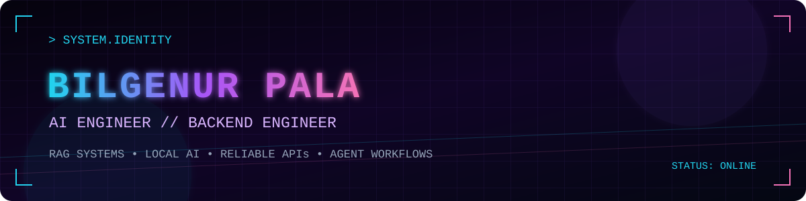

<div align="center">



[](https://linkedin.com/in/bilgenur-pala-892a1a225)
[](https://github.com/bilgenurpala)


`BUILDING INTELLIGENT SYSTEMS // ONE RELIABLE PIPELINE AT A TIME`

</div>

## `01 // IDENTITY`

```text
┌─[ bilgenurpala@ai-engineer ]
│
├─ ROLE        AI Engineer & Backend Engineer
├─ FOCUS       RAG systems · Local AI · APIs · Agent workflows
├─ CURRENT     Backend Engineering Intern @ FlyRank
├─ PRINCIPLES  Reliability · Privacy · Measurable quality
│
└─► Turning AI prototypes into dependable software.
```

I build retrieval-backed applications, production-oriented backend services, and AI workflows designed to be inspectable, testable, and safe to operate.

## `02 // PROJECT DATABASE`

<table>
<tr>
<td width="50%" valign="top">

### `PX-01` 🐾 [PET ADOPT](https://github.com/bilgenurpala/pet-adopt)


Pet adoption platform designed to connect animals with new homes through an accessible product experience.

`Full Stack` · `Product Development`

</td>
<td width="50%" valign="top">

### `PX-02` 🤖 [LOCAL RAG ASSISTANT](https://github.com/bilgenurpala/local-rag-assistant)


Local-first document intelligence with semantic retrieval, grounded answers, source context, and evaluation.

`Python` · `FastAPI` · `RAG` · `Foundry Local`

</td>
</tr>
<tr>
<td width="50%" valign="top">

### `PX-03` ⚙️ [FLYRANK INTERNSHIP](https://github.com/bilgenurpala/flyrank-internship)


Ongoing backend and AI projects covering API contracts, structured pipelines, RAG prototypes, agent loops, and evaluation.

`Backend` · `Python` · `APIs` · `AI Systems`

</td>
<td width="50%" valign="top">

### `PX-04` 🛍️ [NOVASTORE](https://github.com/bilgenurpala/novastore)


End-to-end e-commerce application built around core shopping flows and maintainable application architecture.

`E-Commerce` · `Full Stack` · `Product`

</td>
</tr>
<tr>
<td colspan="2" valign="top">

### `PX-05` ✨ [GLOWUP BACKEND](https://github.com/bilgenurpala/glowup-backend)


Personal backend service exploring practical API development, authentication, databases, and application security.

`REST API` · `Authentication` · `Database` · `Security`

</td>
</tr>
</table>

## `03 // TECH ARSENAL`

<div align="center">

### `[ AI / ML CORE ]`


### `[ APPLICATION / DATA LAYER ]`


### `[ ENGINEERING TOOLCHAIN ]`


</div>

## `04 // ACTIVE PROTOCOLS`

<table>
<tr>
<td width="50%" valign="top">

### `◉ CURRENT FOCUS`

- Building backend systems at **FlyRank**
- Designing reliable **RAG pipelines**
- Improving evaluation and failure handling
- Turning prototypes into tested services

</td>
<td width="50%" valign="top">

### `◈ LEARNING QUEUE`

- Mathematics for Machine Learning
- Production MLOps workflows
- Agent architecture and tool use
- Secure, observable AI applications

</td>
</tr>
</table>

## `05 // CONTRIBUTION MATRIX`

<div align="center">

### `CONTRIBUTION SNAKE // DAILY SYSTEM SCAN`

<picture>
  <source media="(prefers-color-scheme: dark)" srcset="assets/github-contribution-grid-snake-dark.svg" />
  <source media="(prefers-color-scheme: light)" srcset="assets/github-contribution-grid-snake.svg" />
  
</picture>

`AUTO-REFRESH: 24H` · `SOURCE: GITHUB CONTRIBUTIONS` · `MODE: NEON VIOLET`

[View native contribution history](https://github.com/bilgenurpala?tab=overview&from=2026-01-01&to=2026-12-31) · [Explore repositories](https://github.com/bilgenurpala?tab=repositories)

</div>

## `06 // SYSTEM PHILOSOPHY`

```text
[ RETRIEVE ] ──► [ GROUND ] ──► [ EVALUATE ] ──► [ IMPROVE ]

  clear contracts     predictable systems       safer deployments
  local inference     stronger privacy          practical AI
```

## `07 // OPEN CHANNEL`

Interested in RAG architecture, local AI, backend engineering, or production evaluation? Let's connect on [LinkedIn](https://linkedin.com/in/bilgenur-pala-892a1a225) or explore my [repositories](https://github.com/bilgenurpala?tab=repositories).

<div align="center">

`< BUILD CAREFULLY // MEASURE HONESTLY // KEEP LEARNING />`

</div>
